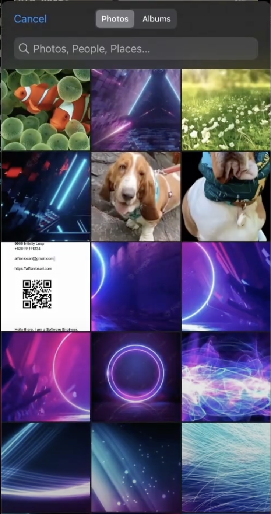
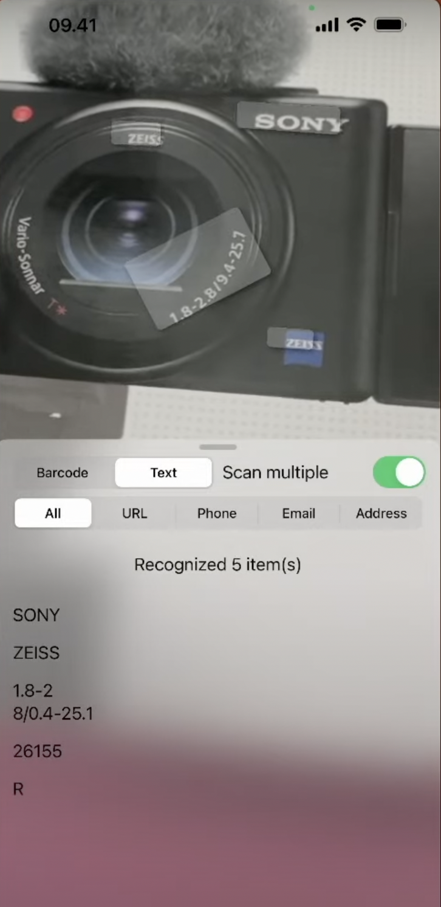
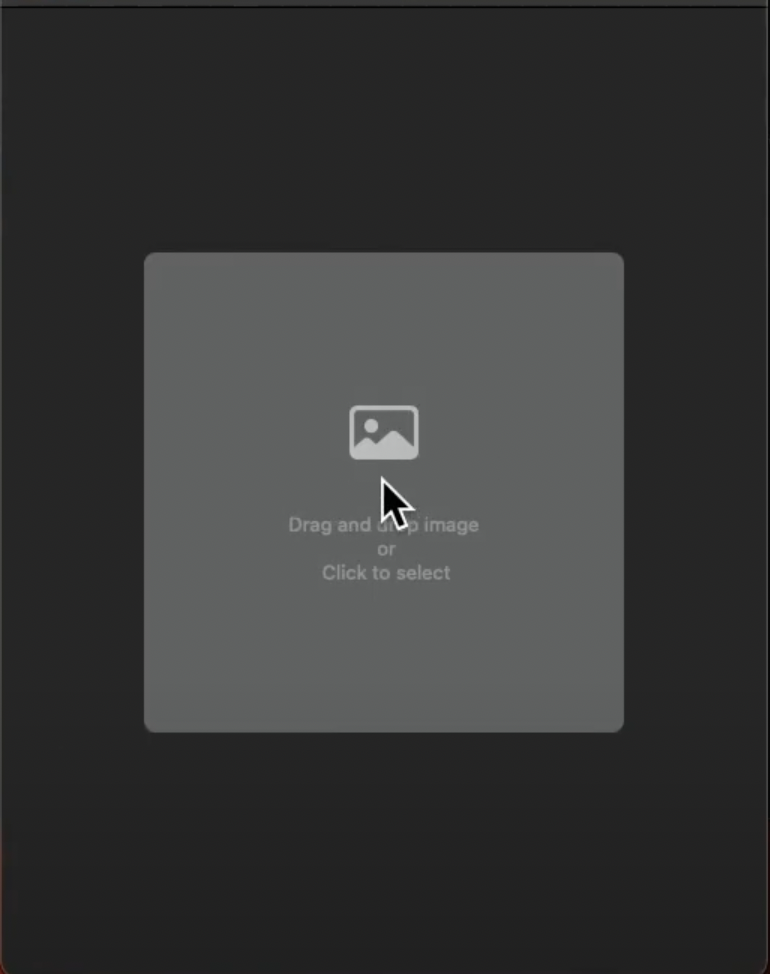

<!-- ABOUT THE PROJECT -->
<p align="center">
  <a href="#" target="_blank"></a>
</p>

# iReader
Aplikasi iReader adalah Aplikasi Pemindai Barcode dan Teks untuk iOS & MacOS dengan fitur Text Scanner via Kamera & Import Files. Aplikasi ini dibuat dengan SwiftUI, AVKit, dan VisionKit (On Device Machine Learning Processing).

### Preview
<p align="center">
  <a href="#" target="_blank"></a>
  <a href="#" target="_blank"></a>
  <a href="#" target="_blank"></a>
</p>

<!-- ABOUT THE FILE & FOLDER STRUCTURE -->
## Folder & File Structure
Berikut struktur file dan folder pada iReader:

    .
    ├── iReaderApp.swift               # Root Project: Konfirgurasi AppViewModel iOS
    │   ├── Info.plist                 # Privacy - Camera Usage Description
    │   ├── ContentView.swift          # Tampilan Beranda Aplikasi iOS
    │   ├── Assets                     # Aset Logo dan Warna
    │   ├── AppViewModel.swift         # Berisikan Deklarasi Data Enum & Fungsi Main Thread
    │   └── DataScannerView.swift      # Berisikan Fungsi Wrapper DataScannerView yang disediakan oleh Apple untuk Scanning Data dengan Camera
    │
    └── iReaderMacApp.swift            # Root Project: Konfirgurasi AppViewModel MacOS
        ├── ContentView.swift          # Tampilan Beranda Aplikasi MacOS
        ├── MacAppViewModel.swift      # Berisikan Fungsi , Import Image, Drag & Drop, NSOpenPanel, Open Selected Image, & Processing Image Upload
        └── MacLiveTextView.swift      # Berisikan Fungsi Live Text Capture for Uploaded Static Image

<!-- List of Features -->
## Features:

* Filter Tipe Text Scanner (All, URL, Phone, Email, Address)
* QR & Barcode Scanner
* Text Scanner
* Live Text Scanner
* Native iOS Media Playback Video Camera (AVKit)
* MacOS App
* Image Select & Upload (Drag & Drop)
* Built-in Native iOS Machine Learning Processing Library (VisionKit)

<!-- Used Tools -->
## Build With:

* [Swift](https://www.swift.org/documentation/)
* [SwiftUI](https://developer.apple.com/documentation/swiftui/)
* [Xcode 14.0](https://developer.apple.com/xcode/)
* [VisionKit Framework](https://developer.apple.com/documentation/visionkit)
* [AVKit](https://developer.apple.com/documentation/avkit)

### Requirements
* [iOS 16.0 Beta](https://developer.apple.com/documentation/visionkit/datascannerviewcontroller?changes=_8_3)
* [Xcode 14.0](https://developer.apple.com/xcode/)
* [MacOS with Live Text Interaction](https://developer.apple.com/documentation/visionkit/enabling_live_text_interactions_with_images)

<!-- How to Install -->
## Installation
Untuk menggunakan repositori ini, ikutilah petunjuk penggunaan berikut dan pastikan git sudah terinstall pada komputer (semua perintah dilaksanakan pada `cmd.exe` atau `terminal`):

1. Lakukan download .zip atau `clone` repositori dengan cara:
```bash
git clone https://github.com/dekapd99/iReader.git
```

2. Jika sudah silahkan buka Project di Xcode.
3. Untuk bisa dijalankan di iPhone, Sambungkan iPhone dengan komputer Macbook Anda, dan pastikan untuk memilih iPhone tersebut pada Target Simulator (Kolom Device dibagian atas Xcode). 
4. Untuk bisa dijalankan di MacOS, Pastikan Target Scheme (Kolom Device dibagian atas Xcode) itu diubah menjadi MacLiveTextView agar Compiler bisa mendeteksi Tipe imageView dengan Benar.
5. Build & Run

<!-- What Kind of License? -->
## License
MIT License: Copyright (c) 2022 DK

<p align="right">(<a href="#top">back to top</a>)</p>
